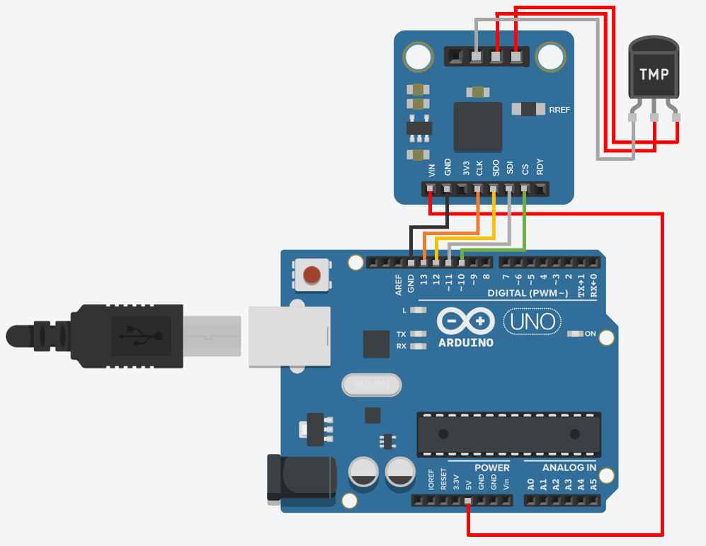

### A tutorial on the Bayesian statistical approach to inverse problems

C and Julia code to reproduce the results of our paper:
> F. Waqar, S. Patel, C. Simon. "A tutorial on the Bayesian statistical approach to inverse problems." (2023) _arXiv_

:tangerine: the raw data collected using the microcontroller setup can be found in the directory `Arduino Results/`

:tangerine: the main microcontroller program is `Inverse_Problem_Main.ino`

:tangerine: data processing code is found in the `data_fitting/` directory. To reproduce our results, run the Pluto notebooks (1) `data_preparation.jl` (2) `bayseian_fit.jl`. 

